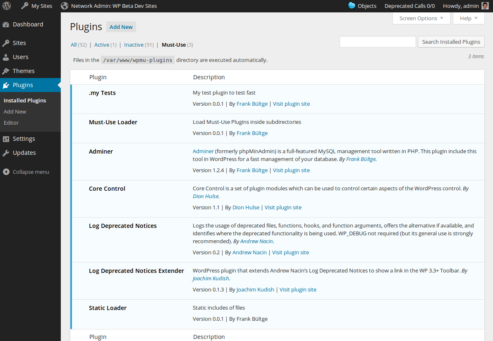

# Must Use Loader
[](https://packagist.org/packages/bueltge/must-use-loader) [](https://codeclimate.com/github/bueltge/must-use-loader/maintainability) [](https://packagist.org/packages/bueltge/must-use-loader)

This small plugin scan and include all plugins in subdirectories from Must Use plugin folder.


## Description
The WordPress Must Use Plugins is an fine way to include without doings in back end. But WordPress does not load plugins in subdirectories, they must be at the root of the  Must Use plugin directory, on default `/wp-content/mu-plugins/`. This small plugin scan and include all plugins in subdirectories from Must Use plugin folder.

The plugin have a simple cache and you flush this cache if you go to the network plugin page, view is enough.

### Screenshots



## Installation
### Manual
 1. Download the php file
 2. Copy to your Must Use plugin folder, default `/wp-content/mu-plugins/`
 3. Alternative define your Must Use folder in the `wp-config.php` and copy the plugin in this folder
 4. Check in the network plugin page, if it works

### Alternative via Composer
The plugin is available as [Composer](https://getcomposer.org/) package and can be installed via Composer.

```shell
composer require bueltge/must-use-loader
```

Or to create as project in your environment.

```shell
composer create-project bueltge/must-use-loader --no-dev
```

The package is on [packagist](https://packagist.org/packages/bueltge/must-use-loader) and the package name is `bueltge/must-use-loader`.

### Alternative via Git
 1. Go to your Must Use folder `cd path`
 2. `git init .`
 3. `git remote add origin https://github.com/bueltge/must-use-loader.git`
 4. `git fetch origin`
 5. `git checkout master`
 6. Check in the network plugin page, if it works


## Customization
### Custom Must Use Plugin directory
Define it in the `wp-config.php` of your install, like the follow source.

```php
// Custom mu plugin directory
define( 'WPMU_PLUGIN_DIR', dirname( __FILE__ ) . '/wpmu-plugins' );
define( 'WPMU_PLUGIN_URL', 'http://' . $_SERVER['HTTP_HOST'] . '/wpmu-plugins' );
```

### Exclude plugins from loader
On default exclude the plugin all plugin files, there start with an underline `_`.
But you can remove plugins detected by the "Must Use Loader" from the loading process by using the `must_use_loader.mu_plugins` filter.
Example:
```php
function prefix_unset_autoloading( $mu_plugins ) {

    unset( $mu_plugins['plugin-folder/plugin-file.php'] );
    return $mu_plugins;
}
add_filter( 'must_use_loader.mu_plugins', 'prefix_unset_autoloading' );
```

## Other Notes
### Bugs, technical hints or contribute
Please give me feedback, contribute and file technical bugs on this 
[GitHub Repo](https://github.com/bueltge/must-use-loader), use Issues.

### License
Good news, this plugin is free for everyone! Since it's released under the [MIT](./LICENSE), you can use it free of charge on your personal or commercial blog. But if you enjoy this plugin, you can thank me and leave a 
[small donation](https://www.paypal.com/cgi-bin/webscr?cmd=_s-xclick&hosted_button_id=6069955 "Paypal Donate link") 
for the time I've spent writing and supporting this plugin. And I really don't want to know how many hours of my life this plugin has already eaten ;)

### Contact & Feedback
The plugin is designed and developed by me ([Frank Bültge](https://bueltge.de), [Twitter](https://twitter.com/bueltge))

Please let me know if you like the plugin or you hate it or whatever ... 
Please fork it, add an issue for ideas and bugs.

### Disclaimer
I'm German and my English might be gruesome here and there. 
So please be patient with me and let me know of typos or grammatical farts. Thanks
